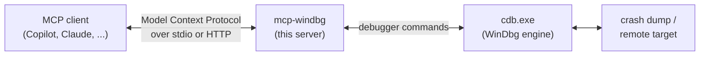

# MCP Server for WinDbg

Analyze **Windows crash dumps** and drive **live or remote debugging** from your AI
assistant, in plain language. Ask *"what caused this access violation?"* and the model
runs the WinDbg commands for you and explains the result.

`mcp-windbg` is a small [Model Context Protocol](https://modelcontextprotocol.io/) (MCP)
server. Your MCP client (GitHub Copilot, Claude Desktop, and others) calls its tools; the
server runs the matching commands in `cdb.exe` (the console WinDbg) and sends the output
back. You get the knowledge of an LLM applied to the real, battle-tested Windows debugger.

---

## What you can do with it

- **[Analyze a crash dump](scenarios/crash-dump.md)** - open a `.dmp`, get the exception,
  faulting instruction, call stack, modules, and threads, then ask follow-up questions.
- **[Debug a remote target](scenarios/remote-debugging.md)** - connect to a live debugging
  session, break in, and inspect threads, memory, and state.
- **[Triage multiple dumps](scenarios/triage.md)** - scan a folder of dumps and compare
  them to spot a common pattern.
- **[Debug from another machine](scenarios/http-service.md)** - run the server over HTTP on a
  Windows host and connect from your own laptop.
- **[Redact sensitive data](scenarios/redaction.md)** - scrub secrets or PII out of tool output
  before it reaches a cloud model.

---

## How it fits together

You install the server, point your MCP client at it once, and from then on you debug by
chatting. The rest of this guide is about that setup and the things you can ask for.

!!! tip "New here? Start with setup."
    If you have not connected an MCP client yet, begin with
    **[Getting started](getting-started.md)**. It covers the prerequisites, installation,
    and your first crash dump analysis.

---

## Requirements at a glance

| You need | Why |
| --- | --- |
| **Windows** (x64) | The server drives `cdb.exe` from the Windows debugger, which is Windows-only. |
| **Debugging Tools for Windows** | Provides `cdb.exe`. Installed with WinDbg from the Microsoft Store, or the Windows SDK / WDK. See [Getting started](getting-started.md). |
| **An MCP client** | GitHub Copilot in VS Code, Claude Desktop, GitHub Copilot CLI, or any MCP-compatible client. See [Client configuration](reference/clients.md). |
| **`uv` or Python 3.10+** | To run the server. `uvx` is the simplest path and needs no manual install step. |
| **Symbols for your target** | So the debugger can map addresses back to functions and source. A symbol server works out of the box. |

!!! note "What this is, and is not"
    This is a **usage** guide for analyzing dumps and debugging with an MCP client. The server
    is a wrapper around `cdb.exe` that lets an LLM run real debugger commands; it is not a magic
    auto-fix. It works on **dump files** and on **connecting to a debugging server**
    (`cdb`/WinDbg started with `-server`). Kernel-mode (`-k`) debugging and attaching to a
    running process by PID are not supported. For building the server from source, see the
    project [`README.md`](https://github.com/svnscha/mcp-windbg).
