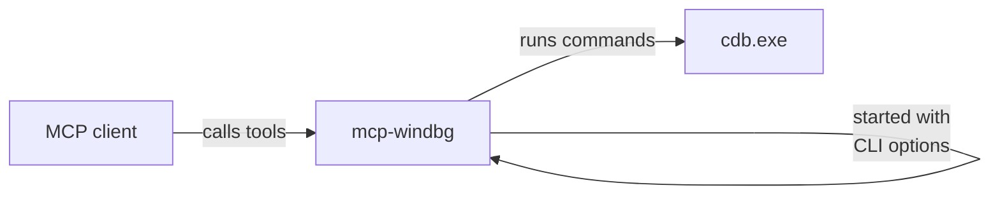

# Reference

The precise, lookup-style reference for `mcp-windbg`.

- **[Command-line options](cli.md)** - every flag for the `mcp-windbg` executable,
  transports, symbol and CDB paths, and the filter script hooks.
- **[Tools](tools.md)** - the MCP tools the server exposes, their parameters, and the
  WinDbg commands that come up most often.
- **[Client configuration](clients.md)** - configuration snippets for VS Code, Claude
  Desktop, and GitHub Copilot CLI, plus pip and from-source installs.

## How the pieces relate

You configure the **client** (clients.md) to launch the **executable** with **CLI options**
(cli.md); the model then drives the **tools** (tools.md) during a session.
